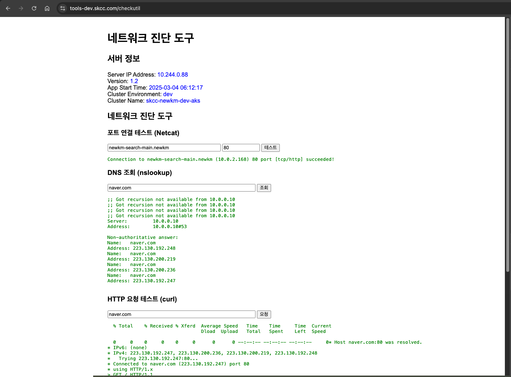
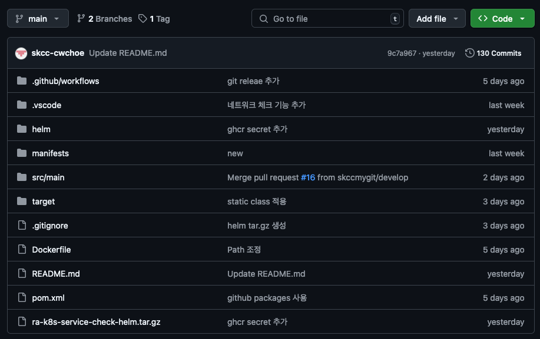
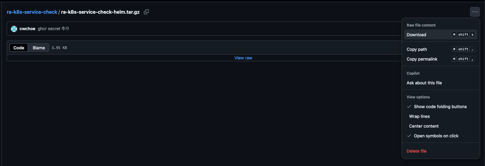
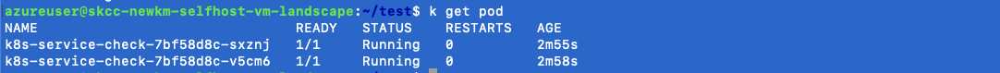

# ra-k8s-service-check

## 개요 

본 소스코드는 ks8 클러스터에 pod 로 배포되어 배포된 클러스터 내에서의 네트워크 상태를 해당 서비스의 웹 화면을 통해 체크할 수 있는 기능을 제공한다.
대표적인 기능으로,

1. 해당 클러스터에 배포된 pod 의 IP 및 기본 정보
2. curl
3. nslookup
4. ns -vz 를 활용한 접근 테스트

와 같은 기능이 있다.

### 주요 화면 스크린샷

  

## 사용 방법

1. 먼저 배포를 실행할 서버 또는 PC 에 helm 이 설치되어 있어야 한다. ( https://helm.sh/docs/intro/install/ )
   설치되어 있으면 아래 내용은 무시한다.
   
        curl -fsSL -o get_helm.sh https://raw.githubusercontent.com/helm/helm/main/scripts/get-helm-3
        chmod 700 get_helm.sh
        ./get_helm.sh 

2. 본 레파지토리내 압축파일을 다운로드합니다.(하단 a-k8s-service-check-helm.tar.gz 파일 클릭 후 우측 ... 버튼 클릭하여 다운로드 진행)

  
  

3. 다운받은 파일 압축 해제 - 압축 해제는 k8s 접근 및 명령을 실행 가능한 환경에서 수행합니다.

       tar -xvzf ra-k8s-service-check-helm.tar.gz   
   
4. 댜음 helm 명령어로 실행

   이 때 --set 옵션으로 개별 환경에 맞게 적절히 수정해서 배포합니다.
   (이 경우는 k8s 에 nginx ingress controller 가 설치되어 있고 루트 컨텍스트의 Ingress가 설정되어 있어야 합니다. 그 외는 ingress 또는 service 파일을 환경에 맞게 적절히 수정해야 합니다.)
   
         helm upgrade --install k8s-service-check helm \
          -f helm/values-dev.yaml \
          --namespace default \
          --set clusterName=yourClusterName \
          --set image.repository=ghcr.io/skccmygit/ra-k8s-service-check \
          --set image.tag=latest \
          --set image.pullSecret=ghcr-secret \
          --set ingress.host=yourHostDomainName

 7. pod 구동 확인

  

  
8. 브라우저 확인

   브라우저에서 http(s)://*위에서 설정한 ingress-hosts-url*/checkutil 을 입력
